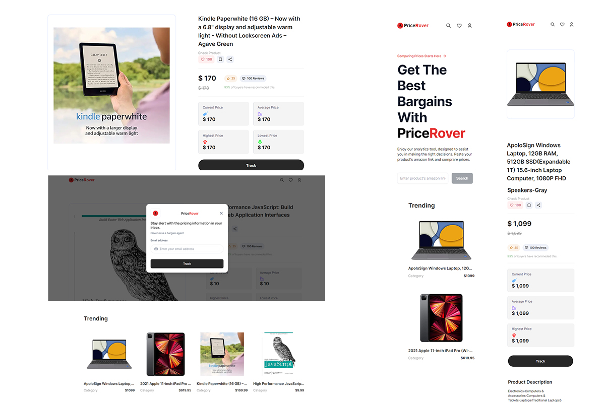

<a name="readme-top"></a>
<!--


<!-- PROJECT SHIELDS -->
<!--
*** I'm using markdown "reference style" links for readability.
*** Reference links are enclosed in brackets [ ] instead of parentheses ( ).
*** See the bottom of this document for the declaration of the reference variables
*** for contributors-url, forks-url, etc. This is an optional, concise syntax you may use.
*** https://www.markdownguide.org/basic-syntax/#reference-style-links
-->
[![Contributors][contributors-shield]][contributors-url]
[![Forks][forks-shield]][forks-url]
[![Stargazers][stars-shield]][stars-url]
[![Issues][issues-shield]][issues-url]
[![MIT License][license-shield]][license-url]
[![LinkedIn][linkedin-shield]][linkedin-url]


<!-- PROJECT LOGO -->
<br />
<div align="center">
  <a href="https://github.com/elviraIv/price-rover-web-scraping-app">
    
  </a>

<h3 align="center">PriceRover Web Scraping App</h3>

  <p align="center">
    PriceRover helps you make informed purchasing decisions by automatically gathering and comparing prices across Amazon's vast marketplace.
    <br />
    <a href="https://github.com/elviraIv/price-rover-web-scraping-app"><strong>Explore the docs »</strong></a>
    <br />
    <br />
    <a href="https://github.com/elviraIv/price-rover-web-scraping-app">View Demo</a>
    ·
    <a href="https://github.com/elviraIv/price-rover-web-scraping-app/issues">Report Bug</a>
    ·
    <a href="https://github.com/elviraIv/price-rover-web-scraping-app/issues">Request Feature</a>
  </p>
</div>


<!-- TABLE OF CONTENTS -->
<details>
  <summary>Table of Contents</summary>
  <ol>
    <li>
      <a href="#about-the-project">About The Project</a>
      <ul>
        <li><a href="#built-with">Built With</a></li>
      </ul>
    </li>
    <li>
      <a href="#getting-started">Getting Started</a>
      <ul>
        <li><a href="#prerequisites">Prerequisites</a></li>
        <li><a href="#installation">Installation</a></li>
      </ul>
    </li>
    <li><a href="#usage">Usage</a></li>
    <li><a href="#roadmap">Roadmap</a></li>
    <li><a href="#contributing">Contributing</a></li>
    <li><a href="#license">License</a></li>
    <li><a href="#contact">Contact</a></li>
    <li><a href="#acknowledgments">Acknowledgments</a></li>
  </ol>
</details>


<!-- ABOUT THE PROJECT -->
## About The Project
Elevate each purchase into a savvy decision with PriceRover.

<br />
<div align="center">
  <a href="https://github.com/elviraIv/price-rover-web-scraping-app">
    
  </a>


<p align="right">(<a href="#readme-top">back to top</a>)</p>


### Built With

<p align="left">
<a href="https://developer.mozilla.org/en-US/docs/Web/JavaScript" target="_blank" rel="noreferrer"></a><a href="https://www.typescriptlang.org/" target="_blank" rel="noreferrer"></a><a href="https://reactjs.org/" target="_blank" rel="noreferrer"></a><a href="https://nextjs.org/docs" target="_blank" rel="noreferrer"></a><a href="https://tailwindcss.com/" target="_blank" rel="noreferrer"></a><a href="https://www.mongodb.com/" target="_blank" rel="noreferrer"></a>
</p>


<p align="right">(<a href="#readme-top">back to top</a>)</p>


<!-- GETTING STARTED -->
## Getting Started

This is an example of how you may give instructions on setting up your project locally.
To get a local copy up and running follow these simple example steps.

### Prerequisites

This is an example of how to list things you need to use the software and how to install them.
* npm
  ```sh
  npm install npm@latest -g
  ```

### Installation

1. Get a free API Key at https://brightdata.com
2. Get a free API Key at https://www.mongodb.com/atlas
2. Clone the repo
   ```sh
   git clone https://github.com/elviraIv/price-rover-web-scraping-app.git
   ```
3. Install NPM packages
   ```sh
   npm install
   ```
4. Enter your API in `.env.local`
   ```js
   BRIGHT_DATA_USERNAME='ENTER YOUR BRIGHT_DATA USERNAME';
   BRIGHT_DATA_PASSWORD='ENTER YOUR BRIGHT_DATA PASSWORD';
   MONGODB_URI='ENTER YOUR MONGODB URI';

   ```

<p align="right">(<a href="#readme-top">back to top</a>)</p>


<!-- USAGE EXAMPLES -->
## Usage

1. Search for a specific product on Amazon.
2. Copy the Amazon link and paste it in the PriceRover shown form.
3. View Product's details, emphazing on price comparison.
4. Track price movements by providing an email.
5. Check your email for detailed information.

_For more examples, please refer to the [Documentation](https://example.com)_

<p align="right">(<a href="#readme-top">back to top</a>)</p>


<!-- ROADMAP -->
## Roadmap

- [ ]  Implement core features
- [ ] Implement additional product information.
- [ ] Implement alerts via email
- [ ] Integration with other e-commerce platforms.


See the [open issues](https://github.com/elviraIv/price-rover-web-scraping-app/issues) for a full list of proposed features (and known issues).

<p align="right">(<a href="#readme-top">back to top</a>)</p>


<!-- CONTRIBUTING -->
## Contributing


All contributions are welcome.

If you have a suggestion that would make this better, please fork the repo and create a pull request. You can also simply open an issue with the tag "enhancement".
Don't forget to give the project a star! Thanks again!

1. Fork the Project
2. Create your Feature Branch (`git checkout -b feature/AmazingFeature`)
3. Commit your Changes (`git commit -m 'Add some AmazingFeature'`)
4. Push to the Branch (`git push origin feature/AmazingFeature`)
5. Open a Pull Request

<p align="right">(<a href="#readme-top">back to top</a>)</p>


<!-- LICENSE -->
## License

Distributed under the MIT License. See `LICENSE.txt` for more information.

<p align="right">(<a href="#readme-top">back to top</a>)</p>


<!-- CONTACT -->
## Contact

elvira.n.ivanova@gmail.com

Project Link: https://price-rover-web-scraping-app.vercel.app/

<p align="right">(<a href="#readme-top">back to top</a>)</p>


<!-- ACKNOWLEDGMENTS -->
## Acknowledgments


* This project is not affiliated with Amazon and is for educational and personal use only.
* Thanks to the open-source community for providing valuable tools and libraries.

<p align="right">(<a href="#readme-top">back to top</a>)</p>


<!-- MARKDOWN LINKS & IMAGES -->
<!-- https://www.markdownguide.org/basic-syntax/#reference-style-links -->
[contributors-shield]: https://img.shields.io/github/contributors/elviraIv/price-rover-web-scraping-app.svg?style=for-the-badge
[contributors-url]: https://github.com/elviraIv/price-rover-web-scraping-app/graphs/contributors
[forks-shield]: https://img.shields.io/github/forks/elviraIv/price-rover-web-scraping-app.svg?style=for-the-badge
[forks-url]: https://github.com/elviraIv/price-rover-web-scraping-app/network/members
[stars-shield]: https://img.shields.io/github/stars/elviraIv/price-rover-web-scraping-app.svg?style=for-the-badge
[stars-url]: https://github.com/elviraIv/price-rover-web-scraping-app/stargazers
[issues-shield]: https://img.shields.io/github/issues/elviraIv/price-rover-web-scraping-app.svg?style=for-the-badge
[issues-url]: https://github.com/elviraIv/price-rover-web-scraping-app/issues
[license-shield]: https://img.shields.io/github/license/elviraIv/price-rover-web-scraping-app.svg?style=for-the-badge
[license-url]: https://github.com/elviraIv/price-rover-web-scraping-app/blob/master/LICENSE.txt
[linkedin-shield]: https://img.shields.io/badge/-LinkedIn-black.svg?style=for-the-badge&logo=linkedin&colorB=555
[linkedin-url]: https://linkedin.com/in/elvira-ivanova/
